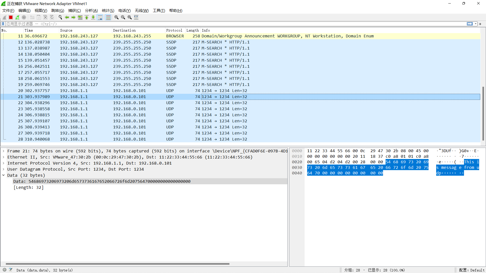

A1: 网络数据包处理对于内存的访问很频繁，使用大页的目的是为了降低TLB miss，减少访存开销。

A2: 首先调用rte_eal_init(argc, argv)函数启动dpdk的运行环境; dpdk面向多核，RTE_LCORE_FOREACH_SLAVE遍历所有EAL可以使用的逻辑核，调用rte_eal_remote_launch在每个lcore上启动指定的线程。在hello_world中，每个线程启动的程序都是lcore_hello。在lcore_hello中，获取逻辑核编号并打印hello_world。 rte_eal_mp_wait_lcore(void) 在主线程上执行，等待所有逻辑核上的任务执行完毕。

A3:  在lcore_main函数中，rte_eth_rx_burst()函数负责收包，rte_eth_tx_burst()函数负责发包。这个程序从每个奇数port处收包，发给对应的偶数port. 对于没发出去的包，就把内存释放掉，也就等于drop了这些包。 rte_eth_rx_burst(uint16_t port_id, uint16_t queue_id, **rx_pkts, uint16_t nb_pkts) 对于网口port_id，将队列queue_id的nb_pkts个包放入首地址rx_pkts中。对应的发包函数，对于网口port_id，将内存指针tx_pkts指向的nb_pkts个包放入queue_id队列上。返回值是成功发送的包的个数。调用rte_pktmbuf_free(struct rte_mbuf *m)将m指针指向的包释放掉。

A4:  rte_mbuf 结构定义在 rte_mbuf_core.h中。其中有几个关键的数据域； void *buf_addr 存段落buffer的虚拟地址； struct rte_mbuf* next存下一个packet对应的mbuf指针； uint16_t port定义了输入端口， eth Tx adapter同样也使用这个域来定义输出端口。uint16_t nb_segs 指定了segments的数目；uint32_t pkt_len 定义了所有segments长度的和；uint16_t data_len  是所有在segment buffer里数据的总长度；uint16_t txq 是被eth Tx adapter使用来存储Tx queue id; struct rte_mempool* pool 是这个结构被定义的内存池的地址；

### build and run
1. 把本目录复制到dpdk/examples/下
2. 需要修改dpdk/examples/meson.build ， 添加一个build_target为udp
3. 在dpdk/build目录下执行sudo ninja install 重新编译
4. 可执行文件在 dpdk/build/examples/dpdk-udp

### 使用wireshark验证udp

1. sudo ./dpdk-udp ，可以发现每一秒发出一个udp packet
2. 在宿主机使用wireshark监听vmwarenet1网卡（设置为host-only模式且已经绑定dpdk），
结果如下

可见dpdk成功发送了报文，mac地址、src_ip, dst_ip, port， message都是在udp.c中设定的值；

### 问题与解决
1. 在使用vmware虚拟机配置custom virtual network时，发现虚拟机网络适配器持续“正在加载虚拟网络”. csdn, google上都没有明确的解决办法。
最后替代方案是切换成vmware预先设定的host-only模式网卡vmnet1，手动指定windows网络中心中此网卡ipv4的网段，使其和虚拟机操作系统的ip在同一子网下。